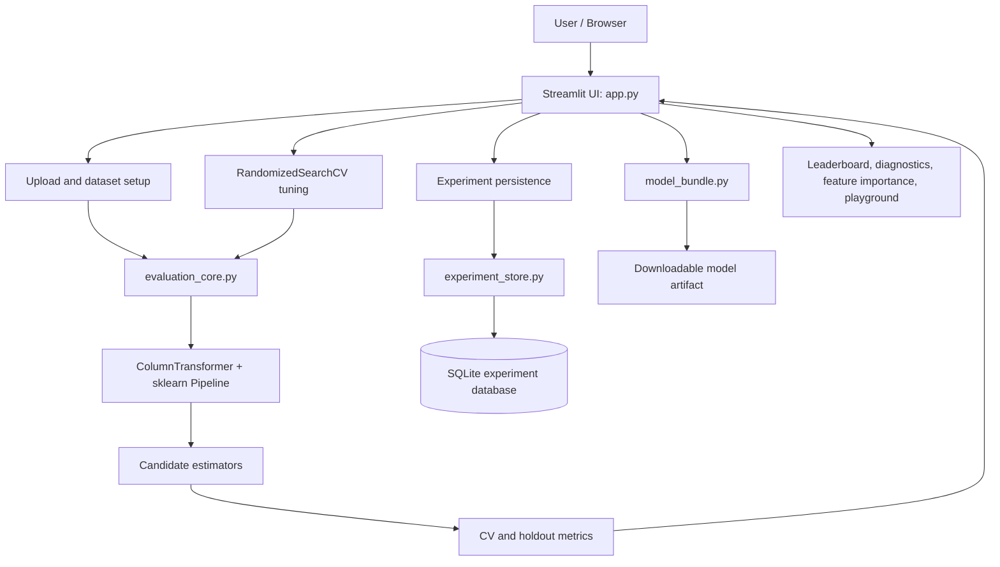
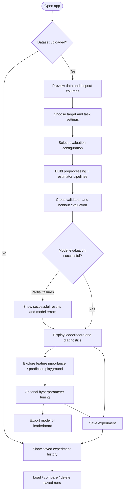

# AutoML Studio

A Streamlit-based, tabular machine-learning workspace for exploring datasets, evaluating classification and regression models, tuning hyperparameters, interpreting model behavior, making interactive predictions, and preserving experiment history.

> **Project status:** Core workflows and features through experiment history have been implemented. Testing status is tracked separately in [Development Checklist](DEVELOPMENT_CHECKLIST.md) and [Development Log](DEVELOPMENT_LOG.md). A checked item means it is supported by the repository record or user-reported verification; deployment and remaining quality gaps are not assumed complete.

## Contents

- [Overview](#overview)
- [Capabilities](#capabilities)
- [Architecture](#architecture)
- [Application flow](#application-flow)
- [Evaluation and leakage prevention](#evaluation-and-leakage-prevention)
- [Repository structure](#repository-structure)
- [Technology stack](#technology-stack)
- [Run locally](#run-locally)
- [Tests and CI](#tests-and-ci)
- [Model export and persistence](#model-export-and-persistence)
- [Known gaps and roadmap](#known-gaps-and-roadmap)
- [Project documentation](#project-documentation)

## Overview

AutoML Studio is designed to make common tabular ML workflows accessible through a browser UI. A user uploads a dataset, selects the target and task settings, evaluates supported estimators, reviews metrics and diagnostics, and can tune or export a fitted model. Experiment history supports revisiting and comparing saved runs.

The app is built with Streamlit, while evaluation and model-related logic are separated into Python modules to keep the UI from owning all ML implementation details.

## Capabilities

| Area | Current capability |
|---|---|
| Data input | CSV, Excel, and JSON upload |
| Dataset exploration | Preview and basic column profiling |
| Task setup | Target selection, task type, excluded features, CV folds, holdout fraction |
| Automated evaluation | Candidate model evaluation and leaderboard |
| Metrics | Classification: accuracy, weighted precision/recall/F1; regression: R², MAE, RMSE |
| Diagnostics | Metric visualization, supported feature importance, classification confusion matrix |
| Prediction | Interactive Prediction Playground |
| Tuning | Randomized hyperparameter search with pipeline-based preprocessing |
| Export | Download leaderboard and fitted model bundle |
| Experiment history | SQLite-backed saved runs, history view, load/delete/compare, and leaderboard |
| Quality | Unit tests and GitHub Actions test workflow |

Availability of specific metrics or interpretation outputs depends on the task and estimator.

## Architecture

### Component view



### Responsibilities

| Component | Responsibility |
|---|---|
| `app.py` | Streamlit entry point, page flow, user controls, visualizations, prediction and export interactions, and history UI |
| `evaluation_core.py` | Task detection, preprocessing construction, model evaluation, metrics, holdout artifacts, progress/error capture, and tuning |
| `experiment_store.py` | SQLite-backed persistence operations for saved experiment records |
| `model_bundle.py` | Pickle-friendly wrapper that preserves original classification labels when exporting a fitted pipeline |
| `ml_engine.py` | Legacy evaluation/preprocessing implementation; the development log notes the app currently uses `evaluation_core.py` |
| `tests/` | Unit tests for evaluation, edge cases, model bundle behavior, and tuning |
| `.github/workflows/tests.yml` | Automated test workflow for pushes and pull requests |

## Application flow

### User workflow



### Evaluation sequence

1. Validate feature/target row alignment and basic input requirements.
2. Detect classification or regression, unless the user explicitly chooses a task.
3. For classification, encode target labels for estimator compatibility while retaining original labels for display/export.
4. Split data into training and holdout partitions.
5. Build preprocessing inside an sklearn pipeline: numeric median imputation and optional scaling; categorical most-frequent imputation and one-hot encoding.
6. Run cross-validation on the training partition (stratified for classification, KFold for regression).
7. Fit the pipeline on training data, score the holdout partition, and collect predictions and diagnostics.
8. Record per-model errors instead of allowing one failed candidate to abort the full evaluation loop.
9. Present results and optionally save the run or export the fitted model.

## Evaluation and leakage prevention

Learned preprocessing is kept inside the estimator pipeline. This allows imputers, encoders, and scalers to be fitted on each training fold rather than on the complete dataset before cross-validation. Hyperparameter tuning similarly receives only the training split; the holdout split is not passed to the randomized search.

Task detection is heuristic when set to automatic. Numeric targets with relatively few unique values can be ambiguous; choose the task explicitly when the domain meaning is known.

## Repository structure

```text
.
├── app.py
├── evaluation_core.py
├── experiment_store.py
├── ml_engine.py
├── model_bundle.py
├── tests/
│   ├── test_evaluation_core.py
│   ├── test_evaluation_edge_cases.py
│   ├── test_evaluation_robustness.py
│   ├── test_model_bundle.py
│   └── test_tuning_core.py
├── .github/
│   └── workflows/
│       └── tests.yml
├── requirements.txt
├── packages.txt
├── DEVELOPMENT_CHECKLIST.md
├── DEVELOPMENT_LOG.md
└── AI_CONTEXT.md
```

The SQLite database file may be created/used by the application at runtime. Do not treat a checked-in local database as a reliable production persistence strategy.

## Technology stack

- **Python** — application and ML workflow
- **Streamlit** — interactive web interface
- **pandas / NumPy** — tabular data handling
- **scikit-learn** — preprocessing, estimators, validation, metrics, and tuning
- **SQLite** — experiment-history storage
- **Matplotlib / plotting libraries** — result visualization as used by the app
- **GitHub Actions** — automated test workflow

See `requirements.txt` and `packages.txt` for the repository's dependency declarations.

## Run locally

### 1. Clone the repository

```bash
git clone https://github.com/piyushgarg1857/data-mining-project.git
cd data-mining-project
git checkout datamining
```

### 2. Create and activate a virtual environment

**Windows (PowerShell):**

```powershell
python -m venv .venv
.venv\Scripts\Activate.ps1
```

**macOS / Linux:**

```bash
python3 -m venv .venv
source .venv/bin/activate
```

### 3. Install dependencies

```bash
python -m pip install --upgrade pip
pip install -r requirements.txt
```

Install any additional system packages listed in `packages.txt` according to your platform.

### 4. Launch the app

```bash
streamlit run app.py
```

Streamlit prints the local URL in the terminal (typically `http://localhost:8501`).

## Tests and CI

Run the repository test suite:

```bash
python -m unittest discover -s tests -v
```

The repository includes a GitHub Actions workflow that runs unit tests on pushes and pull requests. Check the Actions tab for the status of a particular commit. Unit tests do not replace manual browser/UI checks or hosted deployment verification.

## Model export and persistence

- Exported classification bundles include the target label encoder so predictions can be mapped back to original class labels.
- The experiment history uses SQLite through `experiment_store.py`.
- Local SQLite files and Streamlit-hosted filesystem storage may be ephemeral or environment-specific. For durable multi-user production history, plan a managed database and explicit backup/retention strategy.
- Only load serialized model artifacts from trusted sources. Pickle-based formats can execute code during deserialization.

## Known gaps and roadmap

The current checklist records these as remaining work:

- Stronger UI validation for invalid/empty feature selections and very small datasets.
- Clearer per-model progress and failure messaging in the UI.
- Broader edge-case coverage for missing values, multiclass cases, and small class counts.
- Compatibility review for target encoding across supported estimators.
- Clean-environment verification of exported artifacts and documented prediction usage.
- Tuning runtime-limit tests.
- Full test-suite execution before each merge and hosted deployment verification.

Potential next feature: a downloadable model evaluation report. Treat it as planned until implemented and tested.

## Project documentation

- [Development checklist](DEVELOPMENT_CHECKLIST.md) — implementation and verification status
- [Development log](DEVELOPMENT_LOG.md) — dated changes, validation notes, and known gaps
- [AI context / handoff](AI_CONTEXT.md) — concise context for continuing development
- [GitHub Actions](.github/workflows/tests.yml) — CI test workflow

---

**Maintainer:** [piyushgarg1857](https://github.com/piyushgarg1857)  
**Repository:** [data-mining-project](https://github.com/piyushgarg1857/data-mining-project)
